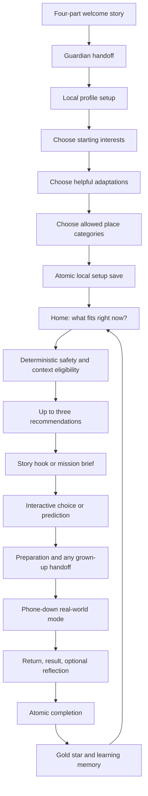
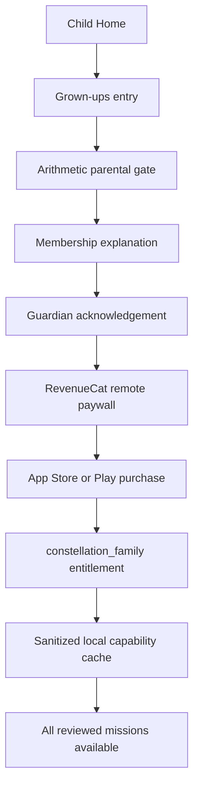

# Constellation — Complete Product and Engineering Review

**Review edition:** September 4, 2026  
**Current implementation:** Expo SDK 57 mobile MVP  
**Current supported child cohort:** ages 6–12 in guardian-led 6–7, together 8–9, and increasing-independence 10–12 variants  
**Purpose of this document:** give families, friends, educators, designers, safety reviewers, engineers, investors, and Shipaton reviewers one accurate place to understand what Constellation is, what already works, how it helps children, how RevenueCat is used, and what should improve before public release.

---

## 1. How to read this document

This is an implementation inventory, not a list of promises.

- **Implemented** means the behavior exists in the current app code.
- **Externally pending** means the app integration exists, but store accounts, platform configuration, legal review, or real-device validation are still required.
- **Proposed** means it is a future direction and is not presented as a current feature.

The current application supports ages **6–7**, **8–9**, and **10–12**. All 25 stable mission identities resolve to age-authored presentation and participation variants. Ages 6–7 never receive solo recommendations, required typing, or independent start permission. Children under 6 and teenagers remain outside this release until separately researched and reviewed.

---

## 2. Product in one sentence

> Constellation uses a small amount of technology to help a child choose and complete a meaningful experience in the real world.

Most children's products try to keep the child engaged with the screen. Constellation tries to create a successful exit from the screen.

The north-star question is:

> What did the child go and do because of Constellation?

Constellation is not a screen-time blocker, homework platform, endless activity feed, open-ended child AI companion, points economy, or generic parenting assistant.

---

## 3. The problem Constellation addresses

Children have access to enormous amounts of digital content, but abundance does not automatically create curiosity, confidence, practical ability, meaningful conversation, or contact with the physical world.

Parents also face a practical problem: finding an activity that is safe, suitable, interesting, possible with the materials nearby, appropriate for the time available, and realistic for whoever is present. Searching for ideas often creates more screen use and decision fatigue.

Constellation tries to remove that decision burden. It does not simply say “go outside” or generate a random activity. It uses the child's locally stored profile and the family's current situation to offer no more than three reviewed possibilities.

The intended developmental direction is:

> Explore → try things → discover interests → practise skills → understand yourself → imagine who you might become.

The MVP only claims to support exploration, trying, observation, reflection, and remembering. It does not diagnose ability, prove mastery, grade a child, or claim to know who the child will become.

---

## 4. Who uses it

### Child

The child:

- sees a small set of real-world missions;
- makes choices inside an authored interaction;
- checks what is needed;
- puts the phone down;
- completes the activity in the real world;
- returns, records a small result or optional reflection, and lights a star;
- sees a personal history of exploration without comparison to other children.

### Parent or guardian

The grown-up:

- completes initial setup;
- chooses allowed place categories and helpful adaptations;
- participates when a mission requires adult support;
- confirms safety handoffs for configured higher-risk missions;
- enters the protected grown-up area for purchases, restoration, or membership management;
- can review what completed stars remember without receiving grades or surveillance evidence.

These roles are deliberately separate whenever safety, privacy, permissions, or money is involved.

---

## 5. Complete end-to-end experience



The app permits only one active mission for the child at a time. A child can resume it, finish later, or stop without penalty. Starting another mission requires an explicit choice to resume the current mission or end it and begin the new one.

---

## 6. Feature inventory

### 6.1 Four-part welcome story — Implemented

The first experience explains Constellation before requesting information.

1. **Curiosity:** “Make the real world more interesting than the screen.”
2. **Context:** “The right idea, at the right moment.”
3. **Phone-down behavior:** “The screen points. You go.”
4. **Meaningful progress:** “Every experience lights a star.”

Sub-features:

- manual horizontal paging;
- progress indicator with accessible step count;
- restrained 6.5-second auto-advance that stops on the final story;
- auto-advance disabled for reduced motion and native screen-reader use;
- accessibility announcement when the active story changes;
- original code-native SVG artwork rather than stock children or generic illustrations;
- slide-to-begin interaction with a tap/accessibility alternative;
- explicit note that a parent or guardian joins setup.

### 6.2 Guardian trust handoff — Implemented

The guardian introduction explains three boundaries before setup:

- **Private by default:** setup and progress remain on the device in the current version.
- **Only what helps:** the app asks for a nickname and age band, not legal name, school, photo, voice, or precise location.
- **Curiosity with guardrails:** experiences come from a reviewed library; there is no unrestricted AI chat for children.

The screen also explains that the guardian controls safety boundaries, permissions, and purchases.

### 6.3 Local profile setup — Implemented

The current MVP creates one local child profile with:

- a nickname of 2–24 trimmed characters;
- age band **6–7**, **8–9**, or **10–12**;
- at least two starting curiosity interests;
- zero or more helpful adaptations;
- at least one allowed place category.

The values remain in a typed setup draft until the final step. The complete setup is then saved atomically; a failed save does not intentionally create a partial profile.

### Starting interests

Every area remains open later. These selections influence ranking rather than defining or limiting the child:

- Nature & noticing;
- Make & create;
- Talk & connect;
- Test & discover;
- Everyday skills;
- Move & be brave.

### Helpful adaptations

All are optional:

- clearer, shorter steps;
- quieter, lower-sensory ideas;
- seated or low-movement choices;
- more time and flexible pacing;
- a grown-up alongside.

These settings describe how an experience can flex. They are not treated as permanent labels or deficits.

Current limitation: `lower-sensory` and `low-movement` participate directly in eligibility, `guardian-alongside` can require a grown-up in the current context, and matching adaptations influence ranking. The current missions do not yet render separately authored “clearer steps” or “flexible pacing” variants. That needs family testing and dedicated content variants before the setup promise is fully realized.

The three age bands participate in eligibility and mission resolution. Each published mission has guardian-led, together, and increasing-independence presentation variants; the youngest variant uses short read-together cues, large choices, and mandatory guardian presence.

### Allowed place categories

- inside home;
- yard or shared outdoor space;
- nearby neighbourhood;
- public places such as parks, libraries, museums, and community spaces.

The app requests categories, not an address or GPS coordinate. Choosing a category does not mean a child may go there alone; every mission still applies its own companion requirement.

### 6.4 Setup transition and recovery — Implemented

“Getting your Constellation ready” truthfully saves the local setup while showing six emerging branches.

Sub-features:

- 900ms minimum visual transition under normal motion;
- shorter static treatment under reduced motion;
- navigation replacement so Back cannot reopen completed setup;
- recoverable error with **Try again** and **Review choices**;
- a root setup gate with loading, missing, complete, and corrupt states;
- guarded repair flow for unreadable local setup.

### 6.5 Main navigation — Implemented

The child-facing app has three destinations:

- **Home:** determine what fits now and choose a mission;
- **Curiosity:** explore all six domains;
- **Constellation:** see stars, learning memories, and exploration history.

Curiosity-area and mission screens open above the tabs with normal native Back behavior. There is no separate Stats tab because progress belongs to the child's Constellation rather than a performance dashboard.

### 6.6 Home context — Implemented

Home greets the child by local nickname and asks “What could you explore today?”

The temporary session context includes:

- **Time:** 10, 20, 30, 45, or 60 minutes;
- **Place:** indoors, outdoors, or either;
- **Who is present:** child alone, grown-up, sibling, or friend;
- **Things nearby:** nothing special, paper and pens, household things, fallen nature finds, or a familiar plant;
- **Local hour:** obtained from the device for daylight/night eligibility;
- **Weather:** currently `unknown` because no weather or location permission is requested.

Defaults are 20 minutes, either place, child alone, nothing special, and unknown weather. These choices are ephemeral and are not added to the permanent child profile.

After the child selects **See today's ideas**, Home displays no more than three recommendations. Each recommendation contains:

- mission title;
- concrete promise;
- duration;
- relevant readiness information;
- one or two plain-language fit reasons;
- an interactive preview that shows the type of action the child will take.

If no mission fits, the app suggests safe changes such as allowing more time, choosing indoors, adding a grown-up, or selecting available materials. It never weakens safety rules just to fill the screen.

If a mission is already active or paused, Home prioritizes returning to it instead of offering a new feed.

### 6.7 Experience Engine — Implemented

Constellation uses a bundled, versioned catalog rather than unrestricted generation.

### Eligibility happens before ranking

A mission is excluded when any relevant rule fails:

- publication or safety-review status;
- Free/Family access capability;
- requested curiosity domain;
- age band;
- available duration;
- indoor/outdoor setting;
- guardian-approved place category;
- companion requirement;
- available materials;
- known or unknown weather;
- daylight or night requirement;
- requested movement adaptation;
- requested sensory adaptation;
- requested guardian-alongside support.

Weather remains unknown without a permission-based adapter. A weather-dependent mission is conservatively excluded rather than guessing.

### Ranking among eligible missions

The deterministic ranking considers:

- selected starting interests;
- exact place fit;
- closeness to available duration;
- whether nothing special is needed;
- novelty compared with completed missions;
- support adaptations;
- variety across curiosity domains.

Stable identifiers provide deterministic tie-breaking. Identical inputs produce stable recommendations. The engine exposes exclusion reasons and fit reasons, allowing engineers to explain why a mission appeared or did not appear.

Selected interests improve ordering but never lock the other five areas.

### 6.8 Curiosity index and area pages — Implemented

The Curiosity index says “Follow your curiosity” and presents all six areas as responsive branch tiles with original SVG symbols. Selected setup interests appear first, but every area remains available.

Every domain page uses one shared typed route and data-driven layout. It contains:

- domain illustration, color identity, description, and invitation;
- number of stars already lit in the branch;
- compact current-context summary;
- one prominent **Try this next** mission;
- up to two quieter alternatives;
- active-state treatment such as **Continue your mission**;
- completed-state treatment such as **A star you lit**;
- **Try another set** when another eligible set exists;
- guidance to change context on Home when nothing safe fits.

There are no locked interest branches, XP requirements, levels, percentages, or completion targets.

### 6.9 Interactive mission framework — Implemented

All 25 published missions have an authored interaction definition. They share a reliable lifecycle without becoming identical templates.

### Mission phases

1. **Narrative hook** for every published mission, expressed as one unique signal inside one of six living worlds.
2. **Mission brief** with the concrete goal and interactive choice, prediction, arrangement, or plan.
3. **Ready check** for place, people, materials, and concise safety conditions.
4. **Grown-up handoff** only when required by reviewed mission configuration.
5. **Phone-down real-world mode** with one large memory cue.
6. **Optional guidance** for missions that benefit from steps, prompt cards, a counter, or timer.
7. **Return** with a mission-specific result interaction when appropriate.
8. **Optional reflection.**
9. **Atomic completion** followed by a restrained gold star/world-resolution moment.

### Reusable interactive primitives

- **Choice board:** select one or several reviewed choices.
- **Ordered cards:** select and arrange a sequence.
- **Prompt deck:** choose a reviewed set of prompts.
- **Marker board:** mark directional or observational positions.
- **Counter:** optional memory aid without scoring.
- **Comparison:** choose what happened or what helped.
- **Slot input:** enter small local phrases in authored slots.
- **Arrangement:** reorder a fixed set using buttons as well as movement controls.
- **Retell cards:** verbally revisit beginning, change, and ending without recording voice.
- **Safety sequence:** choose the safe option, receive calm corrective feedback, and retry.

All required interactions must be complete before starting. The UI validates readiness, and the trusted data layer repeats the same check so navigation or UI manipulation cannot bypass eligibility, preparation, guardian confirmation, or safety interaction requirements.

### Phone-down mode

- one large memory cue;
- **I did it**;
- **Finish later**;
- **Stop this mission** with a second confirmation and no penalty;
- optional step guidance only when useful;
- optional timestamp-derived timer only for relevant missions;
- timer survives backgrounding because it is calculated from timestamps;
- timer expiration never creates failure and never completes the mission automatically.

### One-active-mission rule

Only one session may be active per local profile. Starting another presents:

- **Resume current mission**; or
- **End it and begin this one**.

Paused and active session state survives app restart.

### Return and reflection

Mission-specific result interactions can record an observation, count, comparison, retell, strategy, or safety routine. The universal optional reflection choices are:

- I noticed something new;
- I'd try this again;
- It was tricky;
- Not for me today;
- or light the star without a reflection.

### 6.10 Six living-world flagship missions — Implemented

The free product includes one complete flagship in every curiosity area. Each uses a recurring non-character instrument. These instruments do not speak, show faces, become mascots, or demand attention.

| Area | Flagship and instrument | Story problem and real-world action | What the star can truthfully remember |
|---|---|---|---|
| Nature & noticing | **Rose Signal — Nature Compass** | The Compass cannot identify which rose part may poke. The child completes a plant-safety sequence, observes a familiar approved plant with a grown-up, and keeps hands back. | Used a hands-back safety plan; observed flower, leaves, stem, and sharp parts; discovered that rose sharp parts are called prickles. |
| Make & create | **Build a Paper Bridge — Maker's Workbench** | The Workbench needs a Starway for a tiny delivery. The child chooses a bridge shape, predicts its effect, builds it, and tests lightweight objects. | Predicted how shape could carry a load; tested a bridge; compared which idea helped most. |
| Talk & connect | **Three-Object Story — Story Archive** | Three objects have lost the story connecting them. The child gives them beginning/change/ending roles, co-creates a story, and retells it aloud. | Assigned story roles; retold in three parts; used change to connect the story. No voice or story recording is stored. |
| Test & discover | **Shadow Tracing — Discovery Lens** | Two shadow outlines do not match. The child predicts a change, makes two safe tracings, and compares them. | Predicted a shadow change; compared two tracings; connected change with sunlight direction. |
| Everyday skills | **Build a Cold Snack — Everyday Station** | The Station needs a safe no-heat plan. The child proposes three approved ingredients, completes safety decisions, prepares with a grown-up, and identifies the safe routine. | Completed the safety plan; planned three approved snack parts; identified the routine used. |
| Move & be brave | **Floor-Line Balance — Courage Path** | The Path needs three calm ways across, not speed. The child orders movements, clears the space, tries them, and identifies an adjustment that helped. | Planned three calm movements; noticed an adjustment; practised balance as adjustment rather than scoring. |

Flagship story structure:

> Story signal → predict or create → prepare safely → phone down → act in the real world → return with evidence → understand → save → light a star → resolve the instrument

Before completion, flagship artwork uses ink and the domain accent. Gold appears only after completion is successfully saved.

### 6.11 Full reviewed mission catalog — Implemented

### Nature & noticing — five missions

| Mission | Real-world promise | Interactive preparation and return | Key safety boundary |
|---|---|---|---|
| **Backyard Sound Map** · 20 min | Listen for five sounds and draw where each came from. | Five-direction marker board; optional 10-minute timer/counter guidance. | Remain in a family-approved, stationary listening spot. |
| **Leaf Detective** · 20 min | Compare three fallen leaves by shape, texture, colour, and size. | Arrange four detective lenses; optional visual steps. | Fallen leaves only; do not touch unknown plants, insects, or fungi. |
| **Rose Signal** · 10 min · **Free flagship** | Safely observe how a familiar rose protects itself. | Two-scene safety sequence; return comparison and safety-action selection; Nature Compass story. | Familiar grown-up-approved plant; guardian stays; no touching, picking, tasting, or tools. |
| **Cloud Shape Story** · 10 min | Spot three cloud shapes and connect them into a story. | Select and order three story sparks; phone-down memory cue. | Look from a safe place and never directly at the Sun. |
| **Window Nature Log** · 20 min | Watch one outdoor spot and record what changes. | Choose observation focus; optional 10-minute timer; mark observed changes on return. | Observe through a closed or safely secured window. |

### Make & create — four missions

| Mission | Real-world promise | Interactive preparation and return | Key safety boundary |
|---|---|---|---|
| **Three-Colour Picture** · 30 min | Create a picture using exactly three selected colours. | Three-colour choice board retained as a palette cue. | Washable age-appropriate materials on a protected surface. |
| **Build a Paper Bridge** · 30 min · **Free flagship** | Fold paper into a bridge that holds small objects. | Choose shape and prediction; optional visual build steps; return load counter and comparison; Maker's Workbench story. | Lightweight test objects; take care with paper edges. |
| **Room Rhythm** · 10 min | Compose a rhythm from claps, taps, sounds, and pauses. | Ordered rhythm cards and a prompt-style sequence. | Comfortable volume; never strike breakable objects. |
| **Recycled Sculpture** · 45 min | Turn safe clean packaging into a creature or machine. | Choose creation type; optional assembly guidance. | Grown-up checks clean materials; no sharp edges or glass. Guardian handoff required. |

### Talk & connect — four missions

| Mission | Real-world promise | Interactive preparation and return | Key safety boundary |
|---|---|---|---|
| **Three-Object Story** · 20 min · **Free flagship** | Use three nearby objects to create beginning, change, and ending. | Three local text slots; approved companion turn-taking; non-recording retell cards; Story Archive story. | Ordinary safe unbreakable objects and a family-approved companion. |
| **Family Interview** · 20 min | Ask a grown-up five reviewed questions about learning. | Select a five-card question deck; optional one-question-at-a-time mode. | Trusted grown-up already present; any question may be skipped. Guardian handoff required. |
| **Teach One Small Skill** · 20 min | Teach someone one safe thing step by step. | Local skill-name slot and optional show/explain/try guidance. | No heat, blades, roads, water, or heavy tools. |
| **Two-Minute Explanation** · 10 min | Explain how something works and invite a question. | Local topic slot and speaking cues; optional two-minute timer. | Share only with someone already approved by the family. |

### Test & discover — four missions

| Mission | Real-world promise | Interactive preparation and return | Key safety boundary |
|---|---|---|---|
| **Kitchen Measurement Hunt** · 20 min | Find five measuring marks and compare their meanings. | Five-clue marker board and optional found counter. | Grown-up stays; no heat, blades, appliances, or glass. Guardian handoff required. |
| **Shadow Tracing** · 30 min · **Free flagship** | Trace the same object's shadow twice and compare movement. | Choose useful shadow and prediction; optional ten-minute interval guidance; return comparison; Discovery Lens story. | Approved place, shade/gentle sunlight, and never look at the Sun. |
| **Paper Tower Test** · 30 min | Build and compare three paper tower shapes. | Arrange test order; return choice for tallest result. | Stable floor/table and paper only. |
| **Count a Piece of Sky** · 20 min | Count two small night-sky patches and compare them. | Two simple tally counters without camera access. | Grown-up beside child in a familiar approved place after dark. Guardian handoff required. |

### Everyday skills — four missions

| Mission | Real-world promise | Interactive preparation and return | Key safety boundary |
|---|---|---|---|
| **Invent a Tidy System** · 20 min | Organise one small shelf or drawer using a chosen rule. | Choose type/use/size grouping rule; optional ten-minute timer. | Low lightweight space; no medicines, chemicals, tools, or breakables. |
| **Build a Cold Snack** · 30 min · **Free flagship** | Plan and assemble a simple snack without heat or sharp tools. | Three local ingredient slots; two-scene safety sequence; grown-up confirmation; return safety-routine selection; Everyday Station story. | Adult checks allergies, ingredients, hygiene, and every tool. |
| **Set a Table Pattern** · 10 min | Arrange a place setting and explain its pattern. | Arrange plate, cup, and napkin symbols before recreating it. | Use unbreakable items unless helped; carry one at a time. |
| **Tomorrow Mini-Plan** · 10 min | Create three useful tasks for tomorrow in order. | Local First/Next/Finally slots; paper copy optional. | Keep plan small and flexible; adult decides travel or schedule changes. |

### Move & be brave — four missions

| Mission | Real-world promise | Interactive preparation and return | Key safety boundary |
|---|---|---|---|
| **Floor-Line Balance** · 10 min · **Free flagship** | Follow a floor line three calm ways without rushing. | Choose and order three movements; return strategy comparison; Courage Path story. | Clear dry floor away from stairs, edges, furniture, and breakables. |
| **Mirror Movement** · 10 min | Take turns copying a partner's slow movements. | Choose first leader; optional step guidance and five-minute timer. | Clear space, slow movement, and either person may stop. |
| **One Soft-Ball Skill** · 20 min | Practise one roll, throw, or catch over ten calm tries. | Select skill; optional ten-try return counter that is explicitly not a score. | Soft ball in clear space away from roads, windows, people, and animals. |
| **Slow-Motion Animal Walk** · 10 min | Connect four gentle animal-inspired movements. | Choose and arrange four movement cards; optional visual steps. | Clear floor, gentle movements, stop for pain or unsteadiness. |

### 6.12 Risk-based grown-up handoffs — Implemented

Six missions currently require explicit guardian confirmation:

1. Rose Signal;
2. Recycled Sculpture;
3. Family Interview;
4. Kitchen Measurement Hunt;
5. Count a Piece of Sky;
6. Build a Cold Snack.

Guardian confirmation is a safety handoff, not identity or legal-age verification. The confirmation is kept only in the active mission session and is discarded after completion.

### 6.13 Constellation and progress — Implemented

The Constellation is a record of completed real-world experiences, not XP.

Sub-features:

- deep-midnight map within the otherwise lavender app;
- six deterministic domain branches from one shared origin;
- one gold star derived from every completed outcome;
- stable star placement generated from mission and outcome identifiers;
- repeated completed attempts may create distinct stars;
- skipped missions never create stars;
- pressable 44-point star targets;
- accessible nonvisual count of stars;
- empty state directing the child back to Home without pressure;
- summary of stars lit, experiences tried, and areas explored;
- all six branch summaries shown as “open path” or number of stars;
- recent discovery summary;
- no percentages, completion targets, levels, streaks, rankings, rarity, or public comparison.

### Star detail: “What this star remembers”

A selected star may show:

- mission title;
- completion date;
- optional one-tap reflection;
- factual reveal for a flagship story;
- up to three registry-authored learning-evidence statements.

Allowed evidence verbs include **predicted**, **observed**, **compared**, **retold**, **practised**, and **used a safety plan**. The app never says the child mastered a concept, received a grade, or passed a developmental assessment.

### 6.14 Local persistence and recovery — Implemented

Native persistence uses Expo SQLite with write-ahead logging. Web preview uses local storage with the same logical behavior.

Stored locally:

- one child profile;
- selected interests, support needs, and allowed place categories;
- one active/paused/returning mission session;
- completed and skipped outcomes;
- optional reflection;
- catalog version used by the mission;
- up to three sanitized learning-evidence statements;
- sanitized Free/Family entitlement tier, expiry, and last-check timestamp.

Important persistence rules:

- setup is committed as one operation;
- one active session is enforced by a unique profile constraint;
- completion creates the outcome and deletes the active session in an exclusive transaction;
- completion is idempotent so a double tap cannot create duplicate outcomes or stars;
- stars are derived from completed outcomes rather than stored as an independent reward economy;
- corrupt or legacy evidence falls back to an empty list;
- stopping a mission creates a skipped outcome and no star;
- reset removes local profile, session, and outcomes but intentionally does not erase a valid store entitlement cache.

The reset capability currently supports corrupt-setup recovery. A normal grown-up-facing **delete local child data** and export/explanation screen is not yet implemented and remains release work.

### 6.15 Accessibility and inclusive behavior — Implemented foundation

- Quicksand regular, semibold, and bold weights with clear hierarchy;
- scrollable screens and safe-area handling;
- 44×44-point minimum interactive targets in the core components;
- semantic headings, buttons, radios, checkboxes, progress bars, and images;
- accessibility labels and hints for icon-only or visual controls;
- accessibility announcements for errors and changing onboarding stories;
- reduced-motion alternatives for onboarding, phase transitions, and completion states;
- no color-only correct/incorrect meaning in safety sequences;
- non-drag alternatives for ordered interactions;
- full text labels rather than unexplained emoji;
- timers described as optional and non-scoring;
- calm error, empty, unavailable, and recovery states.

Full native VoiceOver/TalkBack, large-text, contrast, motor-access, and real-device review is still required before release.

### 6.16 Visual system — Implemented

- pale lavender primary canvas;
- Quicksand typography;
- near-black primary ink;
- off-white interactive surfaces;
- warm gold reserved for meaningful stars and saved completion;
- sage, coral, sky, teal, amber, and lilac as quiet domain identifiers;
- deep midnight reserved for phone-down and constellation moments;
- 24-point screen edges and a four-point spacing rhythm;
- restrained continuous corners and shadows;
- original code-native SVG illustrations and symbols;
- no stock children, generic 3D mascots, emoji category icons, or photographic proof demands;
- restrained 240ms transitions and 600–900ms completion moments with reduced-motion alternatives.

---

## 7. How Constellation helps children learn

Constellation does not treat tapping a correct answer as the learning outcome. The interaction prepares a real-world action; learning evidence comes from what the child predicts, notices, creates, explains, retells, decides, or practises.

| Learning behavior | How the product supports it | Example |
|---|---|---|
| Prediction | The child commits to an expectation before acting. | Predict which bridge shape will carry a load or how a shadow will change. |
| Observation | The child pays attention to a real object, place, person, sound, or change. | Compare fallen leaves, map sounds, or inspect a familiar rose safely. |
| Recall | A small return interaction asks what happened without demanding proof. | Select what changed at the window or which balance adjustment helped. |
| Explanation | The child connects the result with an authored factual reveal. | Relate shadow movement to changing sunlight direction. |
| Story structure | The child organizes ideas into beginning, change, and ending. | Retell the Three-Object Story using three visual prompts. |
| Communication | The child listens, interviews, teaches, explains, and takes turns. | Family Interview, Teach One Small Skill, and Mirror Movement. |
| Safety reasoning | The child recognizes a hazard and selects a safer plan before acting. | Hands-back plant observation or no-heat snack preparation. |
| Planning and sequencing | The child arranges steps before performing them. | Tomorrow Mini-Plan, Room Rhythm, and Floor-Line Balance. |
| Iteration | The child tests something and uses the result rather than chasing a score. | Paper Bridge and Paper Tower Test. |
| Self-reflection | The child may name novelty, interest, difficulty, or lack of fit. | “I noticed something new” or “Not for me today.” |

This is evidence that an experience occurred and that a learning behavior was invited. It is not proof of mastery, cognitive measurement, clinical assessment, or a substitute for observing the child directly.

---

## 8. Parent trust and child privacy

### What the app deliberately does not collect

- legal name;
- birth date;
- school;
- email or child account;
- precise location;
- photographs or video;
- microphone or voice recordings;
- contacts;
- public profile;
- advertising identifier for child targeting;
- raw story, ingredient, skill, or plan text after a mission is completed;
- unsafe quiz attempts;
- permanent guardian-confirmation records;
- evidence photos or surveillance proof.

### What stays local

- nickname and age band;
- interests and helpful adaptations;
- guardian-approved place categories;
- current mission choices and temporary child-entered text;
- mission outcomes, optional reflection, learning summaries, and constellation stars.

### Reviewed-content boundary

- every published experience has structured age, duration, setting, place, companion, material, weather, time, adaptation, and safety metadata;
- invalid, unreviewed, draft, or unsafe experiences cannot enter recommendations;
- factual flagship reveals include editorial source labels and review dates;
- AI is not used to invent or approve safety-critical missions;
- there is no open-ended child-to-AI chat;
- any future AI adaptation must remain inside approved wording/material/difficulty boundaries and must never override eligibility.

### Current editorial sources used by flagship definitions

- Rose Signal: Illinois Extension and NC State Extension botanical guidance;
- Paper Bridge: Illinois 4-H Bridge Building Challenge;
- Three-Object Story: SALTO-YOUTH storytelling-basket and three-part-story patterns plus Constellation editorial review;
- Shadow Tracing: NASA Sun–Earth Day and NASA Science Sun-position material;
- Cold Snack: USDA child and school food-safety guidance;
- Floor-Line Balance: Constellation movement-safety editorial review.

Before public release, the publishing record should be expanded to store stable source URLs, reviewer identity/role, review expiry, and change history for every factual or safety-sensitive mission.

---

## 9. RevenueCat SDK and ethical monetization

### 9.1 What is implemented

The project includes:

- `react-native-purchases` version `^10.8.1`;
- `react-native-purchases-ui` version `^10.8.1`;
- `expo-dev-client` version `~57.0.18` for real native purchase testing;
- platform-specific public RevenueCat key selection;
- entitlement resolution;
- RevenueCat Paywalls;
- restore purchases;
- RevenueCat Customer Center for membership management;
- loading, cancellation, missing-configuration, error, free, and Family states;
- local sanitized entitlement caching;
- renewal/expiry refresh for devices that previously received guardian-approved Family access;
- web free-only fallback;
- trusted access checks in both recommendation and mission-start layers.

The RevenueCat entitlement identifier is:

```text
constellation_family
```

Public platform keys are read from:

```text
EXPO_PUBLIC_REVENUECAT_IOS_API_KEY
EXPO_PUBLIC_REVENUECAT_ANDROID_API_KEY
```

No RevenueCat secret key, App Store shared secret, or Google service-account credential belongs in the client bundle.

The native adapter configures the SDK once, uses warning-level SDK logs in development and error-level logs in production, reads `customerInfo.entitlements.active.constellation_family`, maps RevenueCat's purchased/restored/cancelled/not-presented/error paywall results into app states, and requests a close button on the remote paywall. The web adapter deliberately reports purchases as unsupported.

### 9.2 Free and Family offering

| Capability | Free Constellation | Constellation Family |
|---|---:|---:|
| Reviewed real-world missions | Six flagships | All 25 |
| Curiosity areas | All six | All six |
| Constellation and learning memories | Included | Included |
| Child-facing ads | Never | Never |
| Child-facing purchase prompts | Never | Never |

The six free flagships are Rose Signal, Build a Paper Bridge, Three-Object Story, Shadow Tracing, Build a Cold Snack, and Floor-Line Balance.

Family-only activities are filtered out of a free child's recommendation results. They are not shown as tantalizing locked cards. The grown-up membership screen explains the larger catalog separately.

The locked Android launch configuration is:

- monthly product `constellation_family_monthly` at US **$7.99** with no trial;
- annual product `constellation_family_annual` at US **$39.99** with a **14-day annual trial**;
- entitlement `constellation_family` and offering `default`;
- localized storefront pricing;
- all prices, packages, trials, and renewal language controlled remotely through RevenueCat/store configuration rather than hard-coded in the child experience.

Google Play and RevenueCat remain the authoritative source for localized price, trial, renewal, and cancellation terms. The product can be revised remotely after family and conversion evidence without placing price logic in child UI.

### 9.3 Guardian purchase boundary



The arithmetic check helps reduce accidental entry to purchase controls. The UI clearly states that it is not identity or legal-age verification.

Before opening plans, the grown-up must acknowledge the purchase-data boundary. The screen explains that pricing, trial, renewal terms, and confirmation are shown by the App Store or Play Store before charging.

### 9.4 RevenueCat data boundary

The SDK is configured without a custom App User ID and without child attributes. RevenueCat creates and manages an anonymous purchase identity.

| RevenueCat may receive | RevenueCat does not receive from Constellation |
|---|---|
| Anonymous RevenueCat purchase identifier | Child nickname or local profile ID |
| Store product and purchase history | Age band or interests |
| Entitlement status and expiry | Helpful adaptations or allowed places |
| Platform/store information required for purchases | Current context, precise location, or weather |
| SDK diagnostics governed by RevenueCat/store configuration | Mission selections, slot text, safety answers, guardian confirmations, reflections, outcomes, learning evidence, or constellation stars |

Free devices do not initialize RevenueCat on ordinary launch. RevenueCat is first configured after the guardian enters the purchase area and requests plans, restoration, or management. After Family has been activated on a device, the anonymous entitlement may refresh at launch so renewals and expirations remain accurate.

The local entitlement cache contains only:

- tier: `free` or `family`;
- optional expiry timestamp;
- last-check timestamp.

### 9.5 Failure and lifecycle behavior

- Missing platform key: show a calm configuration message and keep the six free missions working.
- Unsupported web platform: purchases remain unavailable; Free continues.
- User cancels: no false success message and no access change.
- Store/RevenueCat error: explain that plans could not be reached; Free continues.
- Purchase or restore succeeds: refresh RevenueCat customer information and persist the sanitized capability.
- Membership expires: capability resolves to Free after expiry/refresh.
- Renewal: a previously approved Family device refreshes entitlement state.
- Mission already active when membership changes: the child may finish the real-world work rather than losing it.
- Reinstall/new device: restore is available through the protected grown-up surface using the store account.

### 9.6 Externally pending RevenueCat work

The SDK integration is complete, but a real purchase cannot be claimed as validated until these external steps are finished:

1. keep the permanent Android package `com.constellation.app`;
2. create the application in Google Play Console;
3. create the matching Android app in the RevenueCat project;
4. create monthly and annual store products;
5. attach them to entitlement `constellation_family` in the current offering;
6. design and publish the RevenueCat Paywall;
7. configure Customer Center;
8. add the public Android SDK key to the EAS production environment;
9. create store sandbox testers;
10. validate purchase, cancellation, expiry, renewal, refund, restore, offline cache, reinstall, and Customer Center in Play builds;
11. verify Google Play Families and Data Safety disclosures against the final AAB.

Expo Go can help preview RevenueCat UI logic, but real store purchases require a development or store build. See [RevenueCat's Expo installation guide](https://www.revenuecat.com/docs/getting-started/installation/expo), [entitlements guide](https://www.revenuecat.com/docs/getting-started/entitlements), [Paywalls](https://www.revenuecat.com/docs/tools/paywalls/displaying-paywalls), and [Customer Center](https://www.revenuecat.com/docs/tools/customer-center/customer-center-react-native).

---

## 10. Technical architecture

### Stack

- Expo SDK 57;
- React Native 0.86;
- React 19;
- TypeScript strict mode;
- Expo Router with typed routes;
- Expo SQLite on native;
- local storage adapter on web preview;
- React Native Reanimated;
- React Native Gesture Handler;
- React Native SVG;
- Quicksand through Expo Google Fonts;
- RevenueCat React Native SDK and UI SDK;
- Expo development client and EAS profiles.

### Major boundaries

- **Catalog:** reviewed versioned experience definitions.
- **Mission registry:** authored interactions, story metadata, preparation, guidance, return questions, evidence rules, and editorial review labels.
- **Eligibility:** deterministic exclusion rules.
- **Ranking:** deterministic scoring and diversification after eligibility.
- **Session context:** temporary time/place/people/material/weather inputs.
- **Persistence:** local profile, one active session, outcomes, evidence, entitlement cache.
- **Progress:** stars derived from completed outcomes.
- **Entitlements:** platform adapter and provider exposing only Free/Family capability to the app.
- **Presentation:** route files stay thin; screen bodies and reusable components live outside routing.

### Trusted mission-start boundary

Immediately before creating a session, the data layer rechecks:

- mission exists in reviewed catalog and registry;
- current entitlement permits access;
- age, duration, setting, allowed place, companion, material, weather, time, and support rules still pass;
- every required brief interaction is complete;
- every preparation item is checked;
- configured guardian confirmation is present.

This prevents UI state, stale recommendations, or direct route navigation from silently weakening a mission's rules.

### No required backend

The core experience currently works without login, cloud sync, remote AI, or a remote catalog. RevenueCat is the only active external product integration and is isolated to anonymous purchasing. This reduces operational and child-data risk for the first release.

---

## 11. Current verification evidence

The current project has passed:

- TypeScript compilation;
- Expo lint;
- Experience Engine validation covering 25 reviewed records and all mission definitions;
- safety gating and deterministic recommendation tests;
- six-flagship narrative/evidence validation;
- Free/Family access-policy tests;
- web persistence and entitlement-cache separation tests;
- idempotent completion and sanitized-evidence tests;
- Expo Doctor: 21/21 checks;
- iOS, Android, and web production export;
- responsive membership-screen review at 320×568 and 393×852;
- browser accessibility-tree inspection and runtime console-error check for the grown-up/membership path.

These checks do not replace native store sandbox testing, native assistive-technology testing, family usability research, security review, or qualified legal/privacy review.

---

## 12. What is intentionally absent

The current product does not include:

- unrestricted child-to-AI chat;
- autonomous AI-generated missions;
- cloud accounts or cross-device child-progress sync;
- public child profiles;
- friends, messaging, followers, leaderboards, or social comparison;
- schools, classes, assignments, grades, or teacher dashboards;
- XP, streaks, badges, loot boxes, rarity, or locked curiosity areas;
- advertising;
- camera evidence, photo uploads, microphone, voice recording, or AR;
- precise location;
- push notifications;
- creator marketplace;
- psychological profiling or career prediction;
- a presentation/content variant for children under 6;
- a live guardian learning dashboard;
- live weather integration;
- live store products or validated sandbox purchases yet.

These are not accidental omissions. Many protect the product's attention, safety, and privacy model. Any future addition must prove that it helps real-world curiosity more than it increases screen dependence or data exposure.

---

## 13. Known gaps and highest-value review areas

### Release-critical

- the Android package is configured, but the EAS project identity still requires an authenticated account;
- Google Play, RevenueCat products, offering, Paywall, Customer Center, and the production public SDK key are still required;
- real Google Play purchase/restore/expiry/refund testing is pending;
- native VoiceOver, TalkBack, large-text, and reduced-motion checks must be completed on devices;
- store privacy disclosures, privacy policy, terms, support URL, and qualified child-privacy/store-policy review are pending;
- at least five consented family usability sessions are required;
- app icon, store screenshots, under-two-minute video, store listing, and judge trial/access must be finalized;
- every safety-sensitive editorial source should gain a stable URL, reviewer identity/qualification, change record, and review expiry.

### Product questions to test with families

- Does a guardian understand the value before setup asks for choices?
- Can a child choose and begin the first mission without adult explanation beyond configured safety needs?
- Does the story layer increase curiosity or delay leaving the screen?
- Are the six free flagships enough to prove value before a guardian sees Family?
- Does the child understand that **Finish later** and **Not for me today** carry no penalty?
- Are 25 missions enough for early retention, or does repetition appear too quickly?
- Does “What this star remembers” feel meaningful and truthful to both child and guardian?
- Do the authored 6–7, 8–9, and 10–12 variants create the right amount of guardian leadership and independence?
- Does a 14-day annual trial give a family enough normal-life opportunities to experience several missions?
- What wording makes Family feel like funding quality and safety rather than buying more content?

### Engineering questions

- Should the first release remain one local profile, or is sibling support essential?
- What is the safest path for guardian-approved backup/restore without creating child accounts?
- Does entitlement behavior remain correct across reinstall, store-account change, grace period, billing retry, refund, and offline launch?
- Should the database migration framework become explicit before schema version 5?
- How should catalog versions remain available for historical star details after wording changes?
- What automated accessibility and screenshot-regression checks should be added to CI?
- How should content-review provenance be signed, audited, and prevented from shipping incomplete?
- What minimal aggregate telemetry can measure activation and retention without child profiling?

### Safety and learning-review questions

- Are the age, companion, material, location, allergy, movement, sensory, night, and Sun-safety boundaries sufficient for every mission?
- Which missions need qualified subject-matter review rather than internal editorial review?
- Are any “solo” missions inappropriate for parts of the 8–9 cohort?
- Do factual reveals distinguish observation from inference clearly enough?
- Do learning-evidence statements stay truthful when a child self-reports completion?
- Are the reflection choices emotionally neutral across different abilities and outcomes?
- What adaptations are missing for low vision, hearing differences, limited mobility, neurodivergence, or language learners?

---

## 14. How Constellation can scale without losing its purpose

These are proposed directions, not current features.

### Content scale

- family-test all 25 implemented living-world stories, improving weak signals without changing the shared safety spine;
- create review tooling with explicit source, reviewer, hazard, age variant, and publication history;
- add new experiences by domain and context gap rather than maximizing catalog count;
- build seasonal and regional mission packs using the same deterministic safety contract;
- localize language, examples, materials, and prices without weakening safety rules.

### Age scale

- validate and refine the implemented guardian-led 6–7 mode before considering any under-6 experience;
- deepen independence, project length, and self-directed reflection for 10–12;
- design a separate teenager expression rather than making the current visual language taller or darker.

### Family value scale

- multiple local child profiles;
- guardian co-view of stars and learning memories;
- privacy-preserving backup and restore;
- printable/off-screen mission cards;
- family turn-taking and multi-day projects;
- new reviewed missions delivered through versioned releases or a carefully controlled remote catalog.

### Business scale

- annual-first Family subscription with regional pricing;
- optional school/library licensing only if it does not turn Constellation into assignments and grades;
- partnerships with museums, parks, science organizations, libraries, and child-development experts;
- creator/editor program only after robust review and publishing controls exist;
- no advertising-led model and no sale of child data.

### Growth loop aligned with the mission

1. Show a short transformation: story problem → phone down → real action → discovery → star.
2. Help a new family complete the first mission within 24 hours.
3. Make the next return useful because it answers “what could we do right now?”
4. Let a guardian see truthful learning memories after real activity.
5. Invite Family only in the grown-up area after the free product has demonstrated value.
6. Share anonymized building lessons and family feedback publicly without child images or identifying content.

Success metrics should include setup completion, first mission start, mission completion/pause, first star, seven-day guardian return, paywall-to-trial, trial-to-paid, and paid retention. Child screen minutes, streak length, notification opens, and raw answer volume must not become success metrics.

---

## 15. RevenueCat Shipaton 2026 case

Constellation's strongest submission positions are:

- **Peace Prize:** the app is designed to move learning, creation, relationships, safety practice, and exploration into the real world.
- **Design Award:** original six-instrument storytelling, interactive mission objects, phone-down mode, and gold-only-after-saved-completion create a coherent visual and interaction system.
- **HAMM Award:** useful Free tier, responsible Family packaging, guardian-only purchase path, remote localized paywall, restore, Customer Center, and no child pressure.
- **Grand Prize eligibility:** requires early public availability, a real RevenueCat purchase, and measurable adoption/revenue growth.

The official Shipaton deadline is **September 30, 2026 at 11:45 PM PDT**. The project should verify all current eligibility and submission details directly against the [official Shipaton rules](https://revenuecat-shipaton-2026.devpost.com/rules) before submitting.

### Suggested under-two-minute demo structure

1. **0–12 seconds:** “Most technology competes for children's attention. Constellation competes for their curiosity.”
2. **12–28 seconds:** guardian boundaries and “What fits right now?”
3. **28–65 seconds:** one flagship, ideally Rose Signal or Paper Bridge: story problem, interaction, safety, phone-down moment.
4. **65–88 seconds:** return, factual reveal, saved gold star, and “What this star remembers.”
5. **88–108 seconds:** rapid view of all six areas and six flagship instruments.
6. **108–120 seconds:** protected Family membership and RevenueCat purchase/restore proof, followed by the real-world outcome statement.

The demo should show an actual store build and actual RevenueCat purchase path. It should not use child-identifying video unless consent, necessity, storage, and submission implications have been fully reviewed.

---

## 16. Reviewer response template

Reviewers can copy this section and answer briefly.

### Product clarity

- In one sentence, what do you believe Constellation does?
- What felt most valuable?
- What felt confusing or unnecessary?
- Would you understand why a family returns more than once?

### Child experience

- Which mission would a child want to try first, and why?
- Where does the app keep the child on the screen too long?
- Does the story create curiosity or feel artificial?
- Does any copy feel too young, too adult, pressuring, or school-like?

### Parent trust

- What would stop you from allowing a child to use it?
- Are safety and privacy boundaries clear enough?
- Is “What this star remembers” useful without becoming a grade?
- What evidence would you need before paying?

### Business and RevenueCat

- Is the six-mission Free tier enough to understand the product?
- Is all 25 missions plus future reviewed additions a clear Family value?
- Which package would you expect: monthly, annual, one-time pack, or something else?
- What price feels plausible, and what would need to be true at that price?
- Does the purchase boundary feel ethical for a children's app?

### Engineering and release

- What is the highest-risk technical assumption?
- What failure or edge case is missing?
- What would block App Store or Play approval?
- What must be tested before calling this production-ready?

### Final recommendation

- **Must fix before beta:**
- **Must fix before public release:**
- **Could improve after Shipaton:**
- **One feature to remove:**
- **One idea worth doubling down on:**

---

## 17. Repository map for engineers

- Product plan: [`plan.md`](plan.md)
- Architecture: [`architecture.md`](architecture.md)
- Durable decisions: [`decision.md`](decision.md)
- Product constitution: [`AGENTS.md`](AGENTS.md)
- Mobile setup and RevenueCat instructions: [`mobile/README.md`](mobile/README.md)
- Experience catalog: [`mobile/src/data/catalog/experience-catalog.ts`](mobile/src/data/catalog/experience-catalog.ts)
- Mission registry: [`mobile/src/data/catalog/mission-registry.ts`](mobile/src/data/catalog/mission-registry.ts)
- Recommendation engine: [`mobile/src/features/recommendations/recommendation-engine.ts`](mobile/src/features/recommendations/recommendation-engine.ts)
- Mission readiness/evidence rules: [`mobile/src/features/missions/mission-state.ts`](mobile/src/features/missions/mission-state.ts)
- Trusted app-data boundary: [`mobile/src/features/app/app-data-provider.tsx`](mobile/src/features/app/app-data-provider.tsx)
- Native persistence: [`mobile/src/data/persistence/app-repository.native.ts`](mobile/src/data/persistence/app-repository.native.ts)
- Entitlement policy: [`mobile/src/features/entitlements/access-policy.ts`](mobile/src/features/entitlements/access-policy.ts)
- RevenueCat provider: [`mobile/src/features/entitlements/entitlement-provider.tsx`](mobile/src/features/entitlements/entitlement-provider.tsx)
- RevenueCat native adapter: [`mobile/src/features/entitlements/revenuecat-adapter.native.ts`](mobile/src/features/entitlements/revenuecat-adapter.native.ts)
- Guardian membership UI: [`mobile/src/screens/guardian/membership-screen.tsx`](mobile/src/screens/guardian/membership-screen.tsx)
- Complete mission UI: [`mobile/src/screens/main/experience-mission-screen.tsx`](mobile/src/screens/main/experience-mission-screen.tsx)
- Constellation UI: [`mobile/src/screens/main/constellation-screen.tsx`](mobile/src/screens/main/constellation-screen.tsx)

---

## Closing principle

Constellation should not win by becoming the app a child uses longest. It should win by becoming the app a family trusts to begin something worthwhile—and then put away.

> Most technology competes for children's attention. Constellation competes for their curiosity.
