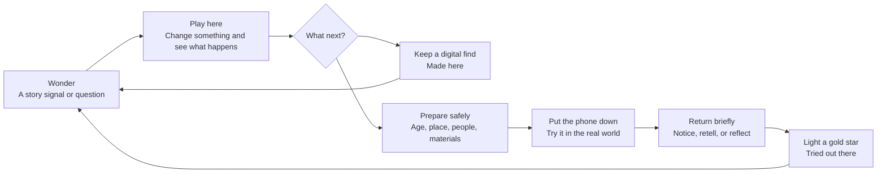
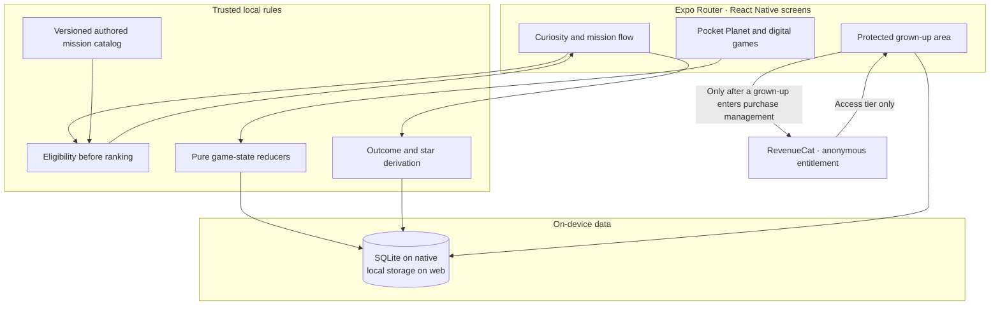

<div align="center">


# Constellation

### A little world shaped by your big ideas.

An experimental, child-and-guardian app where children play with an idea, try something in the real world, and remember what they discovered.

[Explore the app](#what-you-can-try) · [Run locally](#run-it-locally) · [How it works](#how-it-works) · [Release status](#release-status)

</div>

> **Status: local prototype, not a public release.** The app builds and its automated checks run, but independent child-safety review, family testing, store billing verification, and policy review are still outstanding. See [release evidence](mobile/release/README.md).

**Shipaton 2026 Next Gen:** This student-category entry does not require a public app-store release. The [submission brief](store/shipaton-next-gen-2026.md) contains judge-ready copy, the honest RevenueCat boundary, and the remaining submission checklist. The earlier [main-category draft](store/shipaton-submission.md) has different store requirements and should not be used for this entry.

## The idea

Most technology competes for a child's attention. Constellation competes for their curiosity.

Pocket Planet gives children ages **6–12** a small place to experiment with shapes, light, stories, plans, and movement. Some ideas continue as carefully bounded real-world missions. A digital creation stays a **Made here** find; a child-reported physical experience becomes a **Tried out there** star. Neither is presented as a grade or proof of mastery.

A numbered, always-open play trail now brings the digital activities together. A new Number Patterns pilot lets younger children find complements to ten and older children investigate multiplication near ten or 100 by moving a number marker. The pilot's content still needs independent editorial and family review.



The two branches are intentionally different: digital play is useful on its own, and the physical mission never requires camera, voice, location, or a surveillance-style “proof.”

The Paper Bridge mission now invites a prediction, one real test, and an optional revised test; its gold star remembers bounded, child-reported results rather than awarding a score. Mission prompts also have optional tap-to-hear narration using an installed Indian-English voice when available. The device decides the exact voice, and no child response is recorded.

## What you can try

| Place | On-screen play | Real-world connection |
| --- | --- | --- |
| **Paper Post** | Change a paper bridge and test a parcel crossing. | Build and compare a paper bridge nearby. |
| **Borrow a Shadow** | Move a model light and observe where shade falls. | Trace a real shadow when the catalog's daylight and safety rules fit. |
| **Object Theatre** | Arrange three scenes and play a short story. | Tell a three-object story with an approved companion. |
| **Everyday and movement paths** | Sort finds or arrange a calm movement sequence, with specific feedback and a chance to revise. | Follow the matching, safety-checked activity when appropriate. |
| **Maker’s Workbench** | Sketch shapes and test a paired-gear arrangement in an unscored sandbox. | Try an optional paper or observation prompt; these sketches are not saved finds or stars. |

The **Curiosity** library also contains 25 authored story-missions across six areas: Nature & Noticing, Make & Create, Talk & Connect, Test & Discover, Everyday Skills, and Move & Be Brave. Each mission has a story hook, interactive preparation, real-world objective, safety boundary, brief return, and learning memory. Content and younger-age variants still require independent review before public release.

### Progress without pressure

- No XP, streaks, rankings, ads, or endless feed.
- Gold stars represent **saved, child-reported real-world completions** only.
- Learning memories describe actions such as “predicted,” “compared,” or “retold”; they do not claim verified understanding.
- Children can pause, stop, retry, or choose a different path without penalty.

## How it works

The app is local-first. The authored catalog and deterministic eligibility logic decide which physical missions may be offered; the interface cannot override safety exclusions. Independent content review remains a release requirement. Game actions and persistence live in separate layers.



RevenueCat is used for guardian-initiated Family membership. It is not sent the child's nickname, age band, interests, mission answers, reflections, or constellation. The app keeps purchase state separate from deletable child data. A guardian can delete the local profile and its progress without erasing the store entitlement.

### Free and Family

The current product design keeps the six flagship physical missions and the playable introductory paths available for free. **Constellation Family** is intended to add the remaining missions and paid game scenarios. Purchases, restore, and subscription management stay behind the grown-up gate; Family-only missions are filtered from child recommendations instead of appearing as locked cards. Store products, prices, trial, and actual billing behavior are **not verified by this repository**.

## Run it locally

Requirements: a current Node.js installation, npm, and an Android/iOS device or web browser supported by the installed Expo SDK. The app lives in [`mobile/`](mobile/).

```bash
cd mobile
npm ci
npx expo start
```

Use the Expo terminal prompts for web or a device; `npx expo start --web` opens the quick browser preview directly. Expo Go can preview ordinary UI, but **real RevenueCat purchases require a native development or store build**. See the [mobile setup guide](mobile/README.md) for the public SDK key, development-client workflow, and billing test checklist. Never place private store or service credentials in `EXPO_PUBLIC_` variables.

## Verify a change

From `mobile/`:

```bash
npm run typecheck
npm run lint
npm run test:planet
npm run test:engine
npm run test:persistence
npx expo-doctor
```

`npm run check:release` is a separate, deliberate gate: it fails until attributable human reviews, family observations, support verification, and native billing evidence are recorded. A passing build or test suite is **not** a child-safety or store-readiness certificate.

## Find your way around

```text
mobile/
├── src/app/               Expo Router routes and navigation
├── src/screens/           Child, guardian, planet, and legal screens
├── src/features/          Game logic, mission interactions, recommendations, entitlements
├── src/data/catalog/      Versioned authored missions and curiosity areas
├── src/data/persistence/  Native SQLite and web-storage repositories
├── src/theme/             Constellation visual tokens
├── scripts/               Validation, tests, release checks, asset tooling
└── release/               Evidence requirements and current release record
```

For deeper context, read the [product plan](plan.md), [architecture](architecture.md), [decision record](decision.md), and [product review](CONSTELLATION_PRODUCT_REVIEW.md). Contributors and coding agents should read [AGENTS.md](AGENTS.md) before changing the app, especially the child-safety and privacy boundaries.

The project is open source under the [MIT License](LICENSE). The mobile starter retains its original Expo copyright notice in [`mobile/LICENSE`](mobile/LICENSE).

## Release status

The target is an Android-first release, but **no public availability, purchase, trial, learning outcome, or Shipaton submission is claimed here**. Next Gen is a separate student-prototype entry and does not waive requirements for a future public children's release. The current [release evidence record](mobile/release/evidence.json) has open policy, content-review, family-pilot, billing-device, and support checks. The [Shipaton audit](store/shipaton-audit-2026-09-27.md) tracks additional competition and store requirements. Please do not replace missing evidence with placeholder approvals.

If you're a parent, educator, or engineer reviewing this prototype, the most useful feedback is concrete: where a child hesitated, what they actually changed or tried, whether a safety step was understood, and whether the distinction between digital play and real-world experience remained clear.
