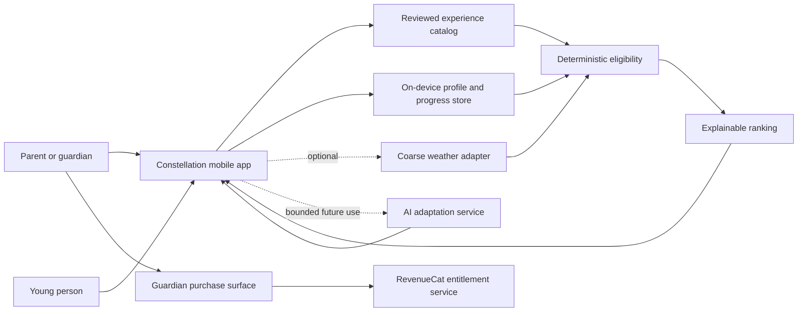
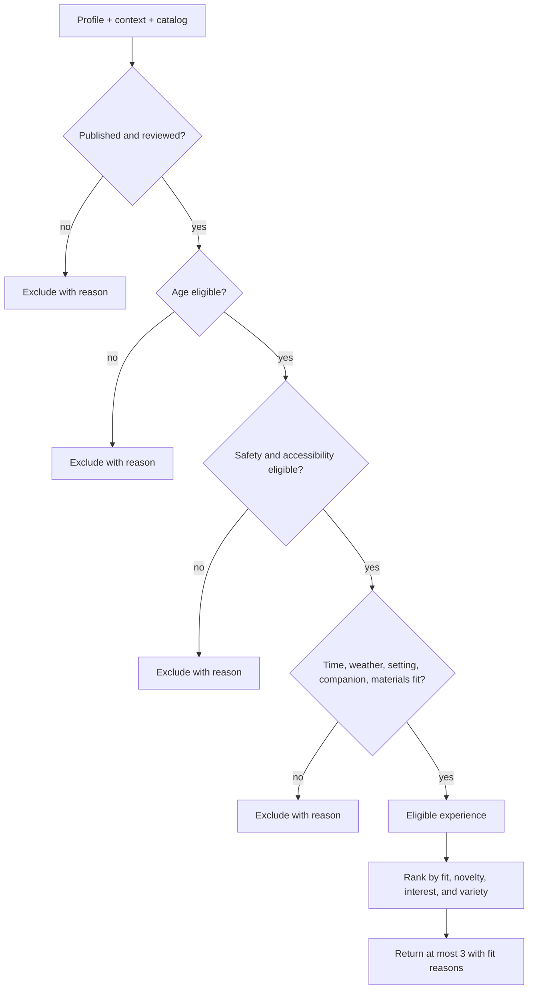

# Constellation Architecture

## 1. Architectural intent

Constellation is a local-first mobile product whose trusted core is a reviewed experience catalog plus deterministic safety and context rules. AI is optional and constrained. The first architecture should make the core loop easy to test without requiring accounts, a backend, precise location, or a model provider.

The architecture optimizes for:

- child safety and explainability;
- privacy through data minimization;
- offline completion of the core loop;
- fast Expo iteration;
- a clear separation between eligibility, ranking, adaptation, persistence, and UI;
- replacement of local adapters with remote services only after product evidence requires it.

It does not optimize yet for schools, social networking, creator marketplaces, global content operations, or real-time collaboration.

## 2. System context



Trust flows inward from reviewed or guardian-provided data. Untrusted external output, including AI output, must be validated before it can affect presentation and must never override eligibility.

## 3. Runtime shape

### Mobile client

- Expo and React Native
- TypeScript in strict mode
- Expo Router with routes under `mobile/src/app/`
- Expo Go as the first development runtime
- On-device persistence for profiles, consent state, context preferences, activity state, and constellation progress
- Bundled reviewed catalog so discovery works offline

### Optional external adapters

- RevenueCat for guardian entitlements
- Coarse weather lookup when the guardian provides a city/region or explicitly enables a suitable source
- Crash and product diagnostics configured to exclude child-identifying data
- Future bounded AI adaptation behind a server-side interface

### No required backend in the first slice

The MVP does not require login, cloud sync, remote catalog administration, or AI to render onboarding and complete the initial experience loop. Remote infrastructure is introduced only when one of these triggers occurs:

- families require cross-device restore of profiles or progress;
- content review and publishing can no longer be managed with versioned bundled catalog releases;
- context services require secrets that cannot live in the client;
- bounded AI adaptation is validated as materially better than deterministic variants;
- product research justifies family accounts.

## 4. Repository layout

The existing root prototypes remain reference artifacts. The runnable app lives in an isolated `mobile/` project.

```text
constellation-ui/
├── AGENTS.md
├── plan.md
├── architecture.md
├── decision.md
├── <prototype folders>/
└── mobile/
    ├── assets/
    ├── scripts/
    ├── src/
    │   ├── app/                     # Expo Router routes only
    │   │   ├── _layout.tsx
    │   │   ├── index.tsx
    │   │   ├── (onboarding)/
    │   │   └── (main)/
    │   ├── components/              # proven reusable UI primitives
    │   ├── screens/                 # route screen bodies
    │   │   ├── onboarding/
    │   │   ├── discovery/
    │   │   ├── experience/
    │   │   ├── constellation/
    │   │   └── guardian/
    │   ├── features/                # domain use cases, not visual components
    │   │   ├── catalog/
    │   │   ├── eligibility/
    │   │   ├── ranking/
    │   │   ├── progress/
    │   │   └── entitlements/
    │   ├── data/
    │   │   ├── catalog/             # bundled reviewed experience definitions
    │   │   ├── persistence/         # SQLite schema and repositories
    │   │   └── adapters/            # weather, RevenueCat, diagnostics
    │   ├── theme/                   # one source of visual tokens
    │   ├── hooks/
    │   ├── utils/
    │   └── types/
    ├── app.json
    ├── package.json
    └── tsconfig.json
```

Rules:

- `src/app/` contains only routes and layouts.
- Screens compose UI and call feature use cases; they do not implement safety rules.
- Feature modules contain pure domain logic and have no React dependency where practical.
- Adapters implement narrow interfaces owned by the feature layer.
- Reusable components are extracted only after a second real use.
- Theme tokens are the only source for repeated colors, type sizes, spacing, radius, shadows, and motion.

## 5. Domain model

### Family and profile

```ts
type AgeBand = "8-9" | "10-12";

type GuardianSettings = {
  consentVersion: string;
  consentedAt: string;
  weatherMode: "manual" | "coarse-region";
  allowedContexts: Array<"home" | "yard" | "neighbourhood" | "public-place">;
  purchasesVisible: boolean;
};

type ChildProfile = {
  id: string;
  nickname: string;
  ageBand: AgeBand;
  interests: InterestId[];
  accessibilityNeeds: AccessibilityNeed[];
  guardianSettingsId: string;
  createdAt: string;
  updatedAt: string;
};
```

The nickname is sufficient for the MVP. Do not request legal name, birth date, school, address, contacts, or profile photo.

### Current context

```ts
type ExperienceContext = {
  localTime: string;
  availableMinutes: 10 | 20 | 30 | 45 | 60 | 90;
  setting: "indoors" | "outdoors" | "either";
  companions: Array<"solo" | "guardian" | "sibling" | "friend">;
  weather: "clear" | "cloudy" | "rain" | "hot" | "cold" | "unknown";
  materialsAvailable: MaterialId[];
};
```

Context is ephemeral unless saving a preference creates clear user value. Precise coordinates are not part of this model.

### Experience definition

```ts
type ExperienceStatus = "draft" | "review" | "published" | "retired";

type Experience = {
  id: string;
  version: number;
  status: ExperienceStatus;
  title: string;
  promise: string;
  instructions: ExperienceStep[];
  ageBands: AgeBand[];
  domains: DomainId[];
  interests: InterestId[];
  skills: SkillId[];
  durationMinutes: number[];
  settings: Array<"indoors" | "outdoors">;
  timeWindows: TimeWindow[];
  weatherAllowed: ExperienceContext["weather"][];
  requiredMaterials: MaterialId[];
  optionalMaterials: MaterialId[];
  companionRules: CompanionRule[];
  accessibility: AccessibilityAdaptation[];
  hazards: HazardRule[];
  stopConditions: string[];
  reflectionOptions: ReflectionOption[];
  followUps: ExperienceId[];
  provenance: ContentProvenance;
  review: SafetyReview;
};
```

Only `published` experiences with a current safety review can enter eligibility.

### Mission definition and active session

The catalog says whether an experience is safe and eligible. A separate typed mission registry says how the child interacts with that experience. Publishing validation fails unless every published experience has exactly one complete mission definition.

```ts
type MissionPhase = "active" | "paused" | "return";

type MissionDefinition = {
  experienceId: string;
  successCue: string;
  interaction: MissionInteraction;
  returnInteractions?: MissionInteraction[];
  preparation: PreparationItem[];
  activeGuidance: "memory-cue" | "optional-steps" | "prompt-deck" | "optional-counter";
  startPolicy: StartPolicy;
  reflectionPrompt: string;
  story?: {
    hook: StoryHook;
    artworkId: StoryArtworkId;
    knowledgeReveal: KnowledgeReveal;
    resolvedWorld: ResolvedWorldState;
    realWorldObjective: string;
  };
};

type ExperienceSession = {
  id: string;
  childProfileId: string;
  experienceId: string;
  catalogVersion: number;
  phase: MissionPhase;
  interactionState: MissionInteractionState;
  contextSnapshot: ExperienceContext;
  timerStartedAt?: string;
  startedAt: string;
  updatedAt: string;
};
```

One active session is allowed per child profile. Child-entered objects, ingredients, skills, and plans live only inside that local session, never in routes, logs, analytics, screenshots, or catalog definitions. Starting another mission requires an explicit choice to resume the current mission or end it before starting the new one.

Story identity is required mission metadata, not a new navigation hierarchy or a replacement for the six Curiosity areas. All 25 missions map a unique `signalId` into one of six reusable worlds and contain a hook, physical objective, factual or reflective reveal, resolved state, editorial provenance, and approved evidence rules. Their recurring instruments are the Nature Compass, Maker's Workbench, Story Archive, Discovery Lens, Everyday Station, and Courage Path. These are non-character tools rather than speaking mascots.

Every mission owns three resolved variants: guardian-led 6–7, together 8–9, and increasing-independence 10–12. Each has a non-empty `briefInteractions` sequence, preparation, concise steps, memory cue, return interactions, and evidence rules. The 6–7 variants replace required typing with large together-confirmations and always require a guardian. The shared interaction union includes choice, ordering, prompt, marker, counter, comparison, slot, arrangement, safety, and accessible retell primitives. Voice and story content are never recorded. A code-native dispatcher renders each world and its unique signal in unresolved, compact, resolved, and reduced-motion states.

World restoration is derived from the versioned mission definition plus completed outcomes. It does not require a badge, unlock, score, or separate world-progress table. Stable experience IDs keep stars historically coherent across age variants.

Safety interactions are risk-based. A `safety-sequence` is authored only when a real hazard needs the child to demonstrate a safe plan; it is not repeated decoration on every mission. A pure start-readiness validator checks the primary interaction, readiness items, and any guardian confirmation. The screen and data provider both call that same rule before a session may be created.

### Outcome and constellation

```ts
type ExperienceOutcome = {
  id: string;
  childProfileId: string;
  experienceId: string;
  experienceVersion: number;
  state: "completed" | "skipped";
  startedAt?: string;
  endedAt?: string;
  reflection?: "again" | "learned" | "challenging" | "not-for-me";
  catalogVersion: number;
  evidence: LearningEvidence[];
};

type ConstellationStar = {
  id: string;
  outcomeId: string;
  primaryDomain: DomainId;
  litAt: string;
  positionSeed: string;
};
```

Stars derive from completed outcomes. They do not hold scores, rarity, monetary value, public rank, or streak multipliers.

## 6. Selection pipeline



The pipeline returns both results and exclusion reasons. Explanations are developer-visible for every candidate and user-visible in a short positive form for recommendations.

### Eligibility

Eligibility is deterministic and conservative:

- `eligible`: all hard constraints pass;
- `ineligible`: at least one hard constraint fails;
- `needs-guardian`: the experience is valid only with active guardian participation;
- `unknown`: required context is missing; default to exclusion or a safe manual confirmation.

### Ranking

Ranking runs only on eligible candidates. It may consider:

- context fit;
- interest fit;
- novelty relative to recent outcomes;
- domain variety;
- suitable challenge progression;
- available time fit;
- companion preference.

Ranking must not infer personality, intelligence, diagnosis, socioeconomic status, or future occupation.

## 7. AI boundary

AI is not required for the first onboarding slice or the first deterministic catalog release.

If introduced later, AI may:

- rewrite approved copy for an age band;
- suggest a shorter duration variant already allowed by the experience;
- swap a material with an approved equivalent;
- translate reviewed content;
- summarize non-sensitive aggregate feedback for content editors.

AI may not:

- publish an experience;
- override age, hazard, weather, accessibility, guardian, or setting constraints;
- conduct unrestricted conversations with a child;
- interpret a child’s private reflection as a psychological assessment;
- infer sensitive traits;
- decide purchases, consent, or data sharing;
- write directly to trusted progress or catalog state.

All model requests belong behind a server-side adapter. Inputs are minimized and outputs are validated against an allowed schema and policy rules. Failure returns the deterministic catalog variant.

## 8. Persistence

### Local storage responsibilities

Use on-device SQLite for:

- schema version and migrations;
- guardian consent version and settings;
- child profiles;
- one active or paused experience session per child profile, including interaction state and timer timestamps;
- experience outcomes;
- cached entitlement state needed for graceful offline behavior;
- optional non-identifying diagnostic queue.

Constellation stars are derived views, not independently written records. A star exists only when a completed outcome resolves to a reviewed catalog experience; its placement seed is stable across restarts.

Completing a session is one exclusive local transaction: insert the terminal outcome with a stable session-derived ID, remove the active session, and then derive the star from the committed outcome. Retrying completion is idempotent, so a double tap or interrupted write cannot create duplicate outcomes or stars. Stopping a mission creates a skipped outcome without a star. Optional timers derive elapsed time from persisted timestamps; expiry never completes or fails a mission.

Story choices, safety answers, and child-entered mission details remain inside serialized active-session state. Atomic completion removes that session. The terminal outcome retains only identity and timestamps, optional one-tap reflection, catalog version, and at most three registry-authored learning-evidence statements. Evidence is derived by trusted rules and cannot copy raw text, unsafe attempts, readiness checks, guardian confirmation, or arbitrary session data.

Native storage schema version 4 contains `catalog_version` and `evidence_json` on outcomes. The three-band expansion needs no new table because age band is already a validated text field. Legacy rows load with catalog version 1 and an empty evidence list; malformed or unknown evidence is discarded. The web adapter mirrors that backward-compatible parsing. Star detail presents this limited record as “What this star remembers,” using verbs such as predicted, observed, retold, or practised without claiming mastery or assessment.

Keep the reviewed catalog in versioned bundled data for the first release. A future signed remote catalog may update it, but the app must retain the last known valid reviewed bundle.

### Data lifecycle

- Profile and progress data remain on device by default.
- Guardian reset deletes local family data after confirmation.
- Retired experience definitions remain resolvable for historical outcomes through their recorded ID and version.
- Schema migrations are forward-only with an explicit development reset path until public beta.
- No silent upload or backup is assumed.

## 9. Navigation and application state

### Route groups

- `/` — shared welcome and product promise.
- `/(onboarding)` — guardian intro, local profile, interests, support preferences, allowed places, and the atomic setup transition.
- `/(main)/(tabs)` — Home, Curiosity, and Constellation.
- `/(main)/curiosity/[domainId]` — one typed screen rendered from the six-area registry.
- `/(main)/experience/[experienceId]` — one typed mission route that renders personalization, readiness, active phone-down guidance, return, reflection, and completion from the persisted session state.
- `/(main)/grown-up-controls` — protected hub for membership, local child data, and safety/support.
- `/privacy`, `/terms`, `/safety`, `/support` — public, statically exportable pages used by the app, EAS Hosting, Google Play, and Shipaton.

The root layout owns the stack. A local setup-state gate determines whether main routes are available. It must avoid navigation loops and must have a recoverable state if setup data is missing or corrupt.

### State categories

- **Persistent domain state** — SQLite repositories.
- **Setup draft state** — one typed onboarding provider, committed only after Allowed Places succeeds.
- **Session context** — one main-shell provider for time, place, companion, materials, and unknown weather; it is deliberately not persisted.
- **Active mission state** — one repository-backed session per child profile; the route renders its phase and serialized authored interaction state.
- **Remote state** — adapter-specific cache; no global networking framework before a real remote use case exists.

Avoid a universal state library until React state and repository hooks become insufficient in measured use.

## 10. Design system boundary

`mobile/src/theme/` owns:

- semantic surfaces and text colors;
- midnight constellation field and warm starlight brand roles;
- sky/information and safety semantic roles;
- 4-point spacing scale;
- native-aligned type ramp;
- continuous radii;
- restrained elevation;
- motion duration and reduced-motion behavior.

`mobile/src/components/` begins with only primitives needed by two or more planned screens:

- `ThemedText`
- `ActionButton`
- `Screen`

The first onboarding hero remains screen-specific until another screen proves reuse. Do not create a generic “cosmic card” abstraction.

Main screens preserve the approved onboarding language: Quicksand, lavender canvas, near-black ink, warm-gold completion stars, off-white surfaces, 24-point edges, continuous corners, and code-native SVG. Sage, coral, sky, teal, amber, and lilac identify curiosity areas only. Deep midnight is reserved for the constellation map.

### Catalog publishing checklist

A bundled experience can enter recommendations only when its runtime shape is valid, its status is `published`, and its review record names the current checklist version. Review confirms:

- age band, duration, setting, allowed place, companion, materials, weather, and time window are explicit;
- the safety note describes a concrete boundary or stop condition;
- guardian participation is required where the activity needs it;
- authored safety sequences are used only for identified risk and must define one correct choice plus calm retry feedback for every scene;
- unknown weather and missing context fail conservatively;
- the experience can be completed without open-ended AI, precise location, photos, voice, or social contact;
- copy makes a concrete real-world promise and does not use XP, streak, ranking, or pressure.

## 11. External integrations

### RevenueCat

- Lives behind a platform-selected `RevenueCatAdapter` and an app-level `EntitlementProvider`.
- Public platform SDK keys come from `EXPO_PUBLIC_REVENUECAT_IOS_API_KEY` and `EXPO_PUBLIC_REVENUECAT_ANDROID_API_KEY`; no store shared secret or RevenueCat secret key is bundled.
- A free device reads only the sanitized local entitlement cache during ordinary app launch. The RevenueCat SDK is first configured lazily after a grown-up passes the gate and explicitly opens plans, restores, or manages membership. After Family has been approved on that device, launch may refresh the anonymous entitlement so renewals and expirations remain accurate.
- Configuration omits a custom App User ID and all attributes. RevenueCat therefore owns an anonymous purchase identity that is never derived from the child profile.
- Entitlement `constellation_family` resolves to the local `free | family` capability. The cache stores only tier, expiry, and last-check time; it does not store offerings, receipts, child data, or mission state.
- The recommendation engine filters unavailable missions before ranking, and `AppDataProvider.startExperience` repeats the capability check as the trusted boundary. Existing active sessions may be completed after expiry so a child's real-world work is not discarded.
- The guardian membership screen owns consent explanation, remote paywall, restore, customer center, cancellation, loading, and failure states. The child surface never invokes purchase UI and never displays price, locked cards, or upgrade prompts.
- Web has a deliberate free-only adapter in this slice. Expo Go can exercise Preview API purchase UI, while real store purchases require an iOS or Android development/store build.
- If RevenueCat is unavailable or unconfigured, the six flagship missions remain available and the guardian receives a calm configuration/retry state.
- Production Android identity is `com.constellation.app`; RevenueCat contract identifiers are entitlement `constellation_family`, offering `default`, and monthly/annual products `constellation_family_monthly` / `constellation_family_annual`.
- Deleting child data removes profile, active session, outcomes, reflections, and derived stars atomically while preserving the anonymous store entitlement and purchase lifecycle.

### Weather

- Lives behind a `WeatherProvider` interface.
- The default implementation is manual condition selection.
- An optional adapter may accept a guardian-provided coarse region.
- Missing or stale weather returns `unknown`; eligibility treats `unknown` conservatively.
- No provider secret is bundled in the client.

### Diagnostics

- Events describe product mechanics, not child identity or content.
- Allowed examples: onboarding step completed, recommendations returned count, experience started, outcome state, eligibility empty result.
- Disallowed examples: nickname, free-text reflection, precise time/location combinations, photos, private notes, or raw model prompts.

## 12. Failure behavior

| Failure | User behavior | Technical behavior |
|---|---|---|
| Catalog cannot load | Show a calm retry state and no recommendations | Keep last valid bundled catalog; never rank partial invalid data |
| No eligible experience | Offer safe context changes or “try later” | Preserve exclusion reasons for diagnostics |
| Weather unavailable | Ask for manual condition or omit weather-dependent activities | Use `unknown`; do not guess |
| Local database migration fails | Explain that setup needs repair and offer guarded reset | Stop writes; retain diagnostic code without personal data |
| RevenueCat unavailable | Keep free experience working and show guardian retry | Use cached entitlement within defined policy |
| AI adapter unavailable | Use the reviewed deterministic wording | Do not block the activity |
| Experience interrupted | Offer resume, finish later, or stop | Preserve the active session and its interaction state safely |
| Large text causes overflow | Content remains scrollable and controls remain reachable | Treat clipped or unreachable content as a release blocker |

## 13. Security and privacy controls

- No secret in the client bundle.
- No cloud account or remote child identifier in the MVP.
- No precise location permission in the core flow.
- No photos, voice, contacts, advertising identifier, or public profile.
- Mission completion is trusted without camera evidence, microphone capture, uploads, or surveillance proof.
- Child-entered mission text is local, session-scoped, and excluded from diagnostics.
- Guardian confirmation protects reset, purchase, and future data-export actions.
- Debug builds use synthetic profiles and experiences only.
- Logs use internal IDs and result counts, not names or child-generated content.

Before public release, obtain qualified legal review for applicable child privacy, consent, store, and regional requirements. Architecture reduces exposure but is not a substitute for legal advice.

## 14. Verification architecture

### Unit tests

- catalog schema and publishing gate;
- eligibility rules and exclusion reasons;
- ranking stability and diversity;
- constellation star derivation;
- persistence migrations and repositories;
- entitlement capability mapping.

### Component and route tests

- onboarding CTA and navigation;
- form labels, validation, and error recovery;
- recommendation empty/loading/result states;
- child surface does not expose purchase actions;
- large-text and accessibility labels for critical controls.

### Device and visual tests

- smallest supported phone width;
- modern large iPhone and representative Android size;
- dynamic type at large accessibility settings;
- VoiceOver and TalkBack core loop;
- reduced motion;
- offline launch and completion;
- purchase sandbox on both stores before release.

### Safety fixtures

Maintain explicit test cases for:

- outdoor activities after dark;
- heat, cold, rain, and unknown weather;
- missing guardian when one is required;
- unavailable materials;
- age-band mismatch;
- accessibility conflict and adaptation;
- retired or unreviewed content;
- empty eligible set.

## 15. Evolution path

Add infrastructure only in response to evidence:

1. **Local MVP** — bundled catalog, on-device state, manual context, RevenueCat.
2. **Reviewed catalog service** — signed remote catalog and content operations when releases become too slow.
3. **Family account and sync** — only when testers need restoration or multi-device use.
4. **Bounded adaptation service** — only after deterministic variants reach a measured limit.
5. **Broader age bands** — separate presentation and content variants validated with each cohort.

The local domain interfaces should survive these changes. Do not prebuild their remote implementations.
